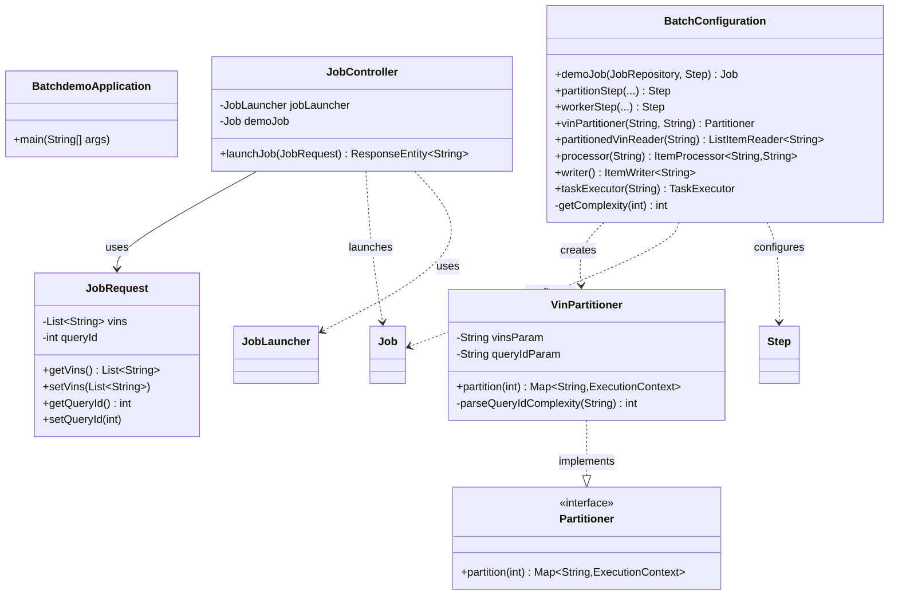

# Spring Batch Demo

A demonstration project showcasing Spring Batch with parallel processing, partitioning, and REST API job submission.

## Overview

This Spring Boot application demonstrates how to:
- Process large datasets using Spring Batch
- Implement parallel job execution through partitioning
- Submit batch jobs asynchronously via REST API
- Dynamically adjust partition sizing based on workload complexity
- Handle I/O-bound operations with configurable concurrency

## Features

- **REST API Job Submission**: Launch batch jobs through HTTP endpoints
- **Dynamic Partitioning**: Automatically splits work based on query complexity
- **Parallel Processing**: Configurable thread pool for concurrent execution
- **In-Memory Metadata Store**: Uses HSQLDB for Spring Batch job metadata
- **VIN Processing**: Simulates Vehicle Identification Number processing with adjustable complexity

## Prerequisites

- Java 17 or higher
- Maven 3.6+ (or use included Maven wrapper)

## Building the Project

Using Maven wrapper (recommended):

```bash
./mvnw clean install
```

Or with your local Maven installation:

```bash
mvn clean install
```

## Running the Application

Start the application:

```bash
./mvnw spring-boot:run
```

The application will start on `http://localhost:8080`

## API Usage

### Launch a Batch Job

**Endpoint**: `POST http://localhost:8080/jobs/launch`

**Request Body**:
```json
{
  "vins": ["VIN001", "VIN002", "VIN003"],
  "queryId": 2
}
```

**Parameters**:
- `vins`: List of Vehicle Identification Numbers to process
- `queryId`: Query complexity identifier (1-3)
  - `1`: Creates 3 partitions with 1 thread (high parallelism, low concurrency per partition)
  - `2`: Creates 2 partitions with 2 threads (balanced)
  - `3`: Creates 1 partition with 3 threads (low parallelism, high concurrency per partition)

**Example with curl**:
```bash
curl -X POST http://localhost:8080/jobs/launch \
  -H "Content-Type: application/json" \
  -d '{"vins":["VIN001","VIN002","VIN003"],"queryId":2}'
```

**Response**:
```text
Job submitted asynchronously
```

## Architecture

The application implements a partitioned batch job architecture:

1. **Job Controller** (`JobController.java`): REST endpoint for job submission
2. **Batch Configuration** (`BatchConfiguration.java`): Defines the Spring Batch job and steps
3. **VIN Partitioner** (`VinPartitioner.java`): Splits VINs into partitions based on complexity
4. **Task Executor**: Thread pool sized according to query complexity (1-3 threads)
5. **Item Processor**: Simulates I/O operations with 2-second delays per VIN

### Class Diagram



### Partition Strategy

The `queryId` parameter controls both partition count and thread pool size:

- **queryId = 1**: 3 partitions, 1 thread → High parallelism with minimal concurrency per partition
- **queryId = 2**: 2 partitions, 2 threads → Balanced approach
- **queryId = 3**: 1 partition, 3 threads → Single partition with maximum thread concurrency
- **Default**: 1 partition, 1 thread → Sequential processing

## Project Structure

```
src/main/java/com/cgoller/batchdemo/
├── BatchdemoApplication.java       # Spring Boot application entry point
├── boundary/
│   └── JobController.java          # REST API for job submission
├── configuration/
│   ├── BatchConfiguration.java     # Spring Batch job configuration
│   └── VinPartitioner.java        # Custom partitioner logic
└── dto/
    └── JobRequest.java            # Request data transfer object
```

## Testing

Run the test suite:

```bash
./mvnw test
```

## Technologies Used

- **Spring Boot 3.4.3**: Application framework
- **Spring Batch**: Batch processing framework
- **Spring Web**: REST API support
- **HSQLDB**: In-memory database for batch metadata
- **Maven**: Build and dependency management

## License

This is a demonstration project for educational purposes.
